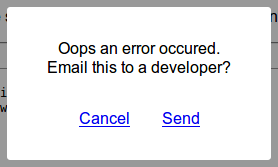

Tiny library to catch all JavaScript errors and send them to your server in `<1k`.

Enable it with a single line before other JavaScript:

```html
<script src="https://chr15m.github.io/catch-all-errors/catch-all-errors.min.js" data-post-url="/api/errorhandler"></script>
```

No more mangled, half-understood, context-free error-feelings reported. \o/

This is intended for self-hosting, small businesses, and indie-hacker scale traffic, not venture backed startup scale traffic.

## API

Catch every error and post to a URL on your server.

```html
<script src="catch-all-errors.min.js" data-post-url="/api/errorhandler"></script>
```

By default only the first JS error is caught to prevent bad code from spamming of your API endpoint. You can change to continuous mode like this:

```html
<script src="catch-all-errors.min.js" data-post-url="/api/errorhandler" data-continous></script>
```

By default the error is propagated through to default the browser resulting in `console.error`s but you can disable this behaviour with `data-prevent-default`:

```html
<script src="catch-all-errors.min.js" data-post-url="/api/errorhandler" data-prevent-default></script>
```

### Show error email modal



Use `data-email-to` to put up a simple modal which will allow the user to email the results to a developer.

```html
<script src="catch-all-errors.min.js" data-email-to='support@yoursite.net'>
```

The way this mode works is to generate a `mailto:` link with the traceback details. When the user clicks "Send" it will open their mail program with a pre-written email to the address nominated.

### Catch all errors in a callback function

Use your own callback function to handle the caught errors. The `data-callback` parameter should specify the name of the callback function which is passed one parameter with the error properties.

```html
<script src="catch-all-errors.min.js" data-callback="catcher"></script>.
```

### Error object properties

Errors will have the following properties when caught and handled:

```json
{
  "message": "blee is not defined",
  "url": "http://localhost:8000/",
  "line": 23,
  "column": 9,
  "useragent": "Mozilla/5.0 (X11; Ubuntu; Linux x86_64; rv:66.0) Gecko/20100101 Firefox/66.0",
  "stack": "window.onload@http://localhost:8000/:23:9\n",
}
```

Where `line` and `column` are the position in the file where the error occured, and `stack` is the stack-trace leading up to the error.

### Example server API

[example-api.php](./example-api.php) provides a simple example of printing the JS errors into the error log using PHP.

### Why use this instead of hosted service X?

 * You like self-hosting stuff.
 * You don't want to sign up for yet another service.
 * You don't need all of their weird complicated features.
 * Those services keep going out of business.
 * You find those services to be over-engineered.

This won't ever become complicated bloatware requiring a signup.
